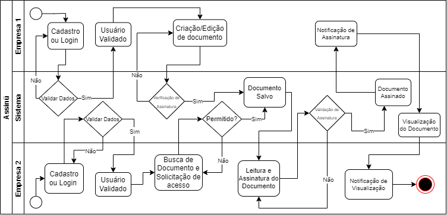
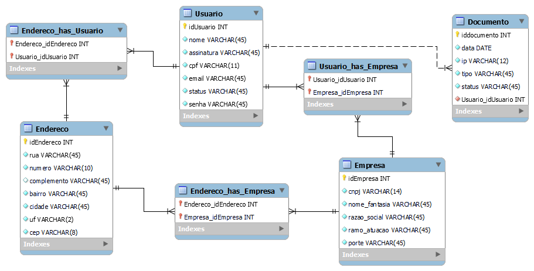

# Informações do Projeto

`Assinü - Gestão de Documentos`  

O Assinü é uma plataforma pensada para empresas que lidam com vários documentos e processos. Dentro da plataforma você poderá autenticar, enviar, editar documentos de forma compartilhada, etc. Todos os documentos de um negócio ficaram em nossos servidores, vinculados a perfis de usuário empresa ou pessoa jurídica.

`CURSO` 

<!-- ......  COLOQUE AQUI O SEU TEXTO ...... -->
Projeto desenvolvido para a disciplina de Trabalho Interdisciplinar: Aplicações para Processos de Negócios do curso de Sistemas de Informaação da Pontifícia Universidade Católica de Minas Gerais.

## Participantes

Os membros do grupo são:
- Davi Perrier Cabral
- Douglas Barbosa da Silva 
- Gabriel Gomes de Oliveira 

# Estrutura do Documento

- [Informações do Projeto](#informações-do-projeto)
  - [Participantes](#participantes)
- [Estrutura do Documento](#estrutura-do-documento)
- [Introdução](#introdução)
  - [Problema](#problema)
  - [Objetivos](#objetivos)
  - [Justificativa](#justificativa)
  - [Público-Alvo](#público-alvo)
- [Especificações do Projeto](#especificações-do-projeto)
  - [Personas e Mapas de Empatia](#personas-e-mapas-de-empatia)
  - [Histórias de Usuários](#histórias-de-usuários)
  - [Requisitos](#requisitos)
    - [Requisitos Funcionais](#requisitos-funcionais)
    - [Requisitos não Funcionais](#requisitos-não-funcionais)
  - [Restrições](#restrições)
- [Projeto de Interface](#projeto-de-interface)
  - [User Flow](#user-flow)
  - [Wireframes](#wireframes)
- [Metodologia](#metodologia)
  - [Divisão de Papéis](#divisão-de-papéis)
  - [Ferramentas](#ferramentas)
  - [Controle de Versão](#controle-de-versão)
<!-- - [**############## SPRINT 1 ACABA AQUI #############**](#-sprint-1-acaba-aqui-) -->
- [Modelagem do Processo de Negócio](#Modelagem-do-processo-de-negócio)
  - [Análise da Situação Atual](#análise-da-situação-atual)
  - [Descrição dos Processos Aprimorados](#descrição-dos-processos-aprimorados)
<!-- - [**############## SPRINT 2 ACABA AQUI #############**](#-sprint-1-acaba-aqui-) -->
- [Modelagem de Dados](#modelagem-de-dados)
  - [Diagrama de Entidade-Relacionamento](#diagrama-de-entidade-relacionamento)
  - [Modelo Relacional](#modelo-relacional)
<!-- - [**############## SPRINT 3 ACABA AQUI #############**](#-sprint-1-acaba-aqui-) -->
- [Relatórios analíticos](#relatórios-analíticos)
- [Projeto da Solução](#projeto-da-solução)
  - [Tecnologias Utilizadas](#tecnologias-utilizadas)
  - [Arquitetura da solução](#arquitetura-da-solução)
- [Avaliação da Aplicação](#avaliação-da-aplicação)
  - [Plano de Testes](#plano-de-testes)
  - [Ferramentas de Testes (Opcional)](#ferramentas-de-testes-opcional)
  - [Registros de Testes](#registros-de-testes)
- [Referências](#referências)

# Introdução

O sistema visa resolver demandas e carências observadas no setor, a seguir descreveremos os principais pontos do projeto.

## Problema

Nosso sistema será voltado para empresas e pessoas jurídicas que trabalham com inúmeros documentos, o que na maioria das vezes se torna algo difícil de gerenciar. Foi pensado também em um grande facilitador: assinaturas digitais. Muitos negócios sofrem para autenticar cópias e contratos enviados para clientes, com isso, ofereceremos para um sistema de assinaturas digitais, com validade.

## Objetivos

O nosso objetivo com esse projeto, como dito acima, é ser um grande facilitador para as pessoas citadas. Sendo possível analisar, criar e validar essas documentações. Com o sistema, conseguiremos abolir o uso de milhares de papéis em gavetas, várias pastas em um único computador para processos, documentos perdidos, etc.

## Justificativa

O que impulsionou a idealizar esse sistema foi entender o quão difícil é gerenciar documentos em larga escala, sendo até não ser possível de cuidar tantos processos, documentos e até mesmo validações. Sendo assim, para quem pretende mudar a esfera de sua empresa ou negócio, esse é o sistema ideal.

## Público-Alvo

O público que escalonaremos é o que tem algum laço com escritórios de advocacia e/ou pessoas jurídicas que precisam validar contratos Freelancer, entre outros. Não atingindo um único gênero, pois ela torna-se uma plataforma aberto a todos. Acreditamos que o público será constituído de sua maioria de potenciais secretários, que trabalham digitalizando documentos e até mesmo advogados.
 
# Especificações do Projeto

Utilizaremos para o desenvolvimento desse projeto as seguintes técnicas de programação:

- PHP
- ReactJs
- JavaScript
- HTML5/CSS
- MYSQL

Com essas linguagens, nos possibilita criar nossa própria ferramenta de trabalho, o que tornaria nosso sistema mais autossustentável.

## Personas e Mapas de Empatia

Exemplos de duas personas relacionadas ao escopo de utilização.

#### Diana Alves
34 anos/ 
Dona de um escritório de advocacia/ 
Graduado em Direito/ 
Casada

Objetivo:
Agilizar processos de assinatura de documentos e simultaneamente digitalizar processos, fazendo com que seu escritório seja mais ágil, tornando os processos menos tediosos para os funcionários e facilitar para os clientes a assinatura do documento, sem fazê-los se locomoverem até o local.

Desafios:
Processos que dependem de impressão e de movimentação do cliente para serem assinados.
Muitos processos em papel, necessitando de inventário.
Necessidade de registro de assinaturas em cartório.

Como posso ajuda-la:
Não havendo a necessidade de impressão e inventário
Facilitando a assinatura de documentos, para o cliente, pois ele não terá que se locomover até o local e não terá que possuir firma registrada em cartório.

--------------------------------------------

#### Renan Carlos
23 anos/ 
Recém formado atuando individualmente/ 
Graduado em direito/ 
Solteiro

Objetivos:
Gerenciar de maneira fácil e de baixo custo as assinaturas de seus clientes e seus documentos.

Desafios:
Possível dificuldade de aderência dos clientes

Como posso ajudá-lo:
tornando o processo mais barato, por não demandar de impressão dos documentos e não dependendo de seu cliente ter que registrar firma ou se locomover até o mesmo, para assinar o documento.

<!-- > Relacione as personas identificadas no seu projeto e os respectivos mapas de empatia. Lembre-se que 
> você deve ser enumerar e descrever precisamente e de forma
> personalizada todos os principais envolvidos com a solução almeja. 
> 
> Para tanto, baseie-se tanto nos documentos disponibilizados na disciplina
> e/ou nos seguintes links:
>
> **Links Úteis**:
> - [Persona x Público-alvo](https://flammo.com.br/blog/persona-e-publico-alvo-qual-a-diferenca/)
> - [O que é persona?](https://resultadosdigitais.com.br/blog/persona-o-que-e/)
> - [Rock Content](https://rockcontent.com/blog/personas/)
> - [Hotmart](https://blog.hotmart.com/pt-br/como-criar-persona-negocio/)
> - [Mapa de Empatia](https://resultadosdigitais.com.br/blog/mapa-da-empatia/)
> - [Como fazer um mapa de empatia - Vídeo](https://www.youtube.com/watch?v=JlKHGpVoA2Y)
> > 
> **Exemplo de Persona**
> 
> 
> 
> Fonte: [Como criar uma persona para o seu negócio](https://raissaviegas.com.br/como-criar-uma-persona/) -->

## Histórias de Usuários

Com base na análise das personas forma identificadas as seguintes histórias de usuários:

|EU COMO... `PERSONA`| QUERO/PRECISO ... `FUNCIONALIDADE` |PARA ... `MOTIVO/VALOR`                    |
|--------------------|------------------------------------|-------------------------------------------|
|Usuário do sistema  | Adicionar processo                 | Iniciar atividade/digitalizar processos   |
|Usuário do sistema  | Checagem de assinatura             | Verificar aceitação do cliente            |
|Usuário do sistema  | Checar processos em aberto         | Verificar andamento de processos          |
|Usuário do sistema  | Assinar documento                  | Dar andamento ao meu processo             |
|Administrador       | Adicionar escritório               | Incluir responsável p/ adicionar usuários |
|Usuário             | Adicionar permissões               | Realizarem suas atividades                |

## Mapa da empatia

|`O que vê?`| `O que ouve?` |`O que pensa e sente?`|`O que ela faz?`|
|--------------------|------------------------------------|----------------------------------------|----------------------------------------|
|Impressões desnecessárias             | Perda de tempo com processos arcaicos.                | Melhoria de desempenho com digitação            | Se importa com o ambiente de trabalho.             |
|                                      |                                                       | Precisa se posicionar quanto as mudanças do mercado             | Valoriza o meio ambiente.             |
|                  |                  | Precisa se posicionar quanto as mudanças do mercado             | Depende de uma apresentaçao visual para que sua postura seja representada.|

|`Quais são as dores?`| `Quais são as necessidades?` |
|------------------------------------|------------------------------------|
|Diminuir sobrecarga de atividades|Facilitar o processo de assinatura|
|Melhorar velocidade dos processos|Gestão de seus documentos|
|Diminuir burocracia|               |

<!-- > Apresente aqui as histórias de usuário que são relevantes para o
> projeto de sua solução. As Histórias de Usuário consistem em uma
> ferramenta poderosa para a compreensão e elicitação dos requisitos
> funcionais e não funcionais da sua aplicação. Se possível, agrupe as
> histórias de usuário por contexto, para facilitar consultas
> recorrentes à essa parte do documento.
>
> **Links Úteis**:
> - [Histórias de usuários com exemplos e template](https://www.atlassian.com/br/agile/project-management/user-stories)
> - [Como escrever boas histórias de usuário (User Stories)](https://medium.com/vertice/como-escrever-boas-users-stories-hist%C3%B3rias-de-usu%C3%A1rios-b29c75043fac) -->

## Requisitos

As tabelas que se seguem apresentam os requisitos funcionais e não funcionais que detalham o escopo do projeto.

### Requisitos Funcionais

|ID    | Descrição do Requisito                                  | Prioridade |
|------|---------------------------------------------------------|------------|
|RF-001| Permitir que o usuário realize cadastros                | ALTA       |
|RF-002| Conceder atribuições de permissões                      | ALTA       | 
|RF-003| Permitir a criação de processos e upload de documentos  | ALTA       | 
|RF-004| Realizar a edição e exclusão de documentos              | ALTA       | 
|RF-005| Autenticar e assinar                                    | ALTA       | 
|RF-006| Enviar documentos e processos para assinatura           | ALTA       | 
|RF-007| Visualizar e checar documentos assinados e autenticados | MÉDIA      |
|RF-008| Checar processos abertos                                | MÉDIA      |
|RF-009| Tela de pesquisa e busca de documentos                  | MÉDIA      |
|RF-010| Notificações de processos realizados                    | MÉDIA      |

<!-- |RF-001| Permitir que o usuário cadastre tarefas | ALTA | -->
<!-- |RF-002| Emitir um relatório de tarefas no mês   | MÉDIA | -->

### Requisitos não Funcionais

|ID     | Descrição do Requisito                                            |Prioridade |
|-------|-------------------------------------------------------------------|-----------|
|RNF-001| Acesso à política de privacidade e segurança de dados             | ALTA      | 
|RNF-002| O sistema deve ser responsivo para rodar em dispositivos móveis   | MÉDIA     | 
|RNF-003| O sistema deve ser multiplataforma em desktop                     | MÉDIA     | 
|RNF-004| Deve processar requisições do usuário em no máximo 3s             | BAIXA     | 
|RNF-005| Possibilidade de criação de documentos em modo offline            | BAIXA     | 
|RNF-006| Canal de reclamações, sugestões e ajuda sobre o sistema           | BAIXA     | 
|RNF-007| Opções de acessibilidade para o usuário                           | BAIXA     | 
|RNF-008| Personalização de template                                        | BAIXA     | 

<!-- |RNF-001| O sistema deve ser responsivo para rodar em um dispositivos móvel | MÉDIA | -->
<!-- |RNF-002| Deve processar requisições do usuário em no máximo 3s |  BAIXA | -->
<!--  > Com base nas Histórias de Usuário, enumere os requisitos da sua
> solução. Classifique esses requisitos em dois grupos:
>
> - [Requisitos Funcionais (RF)](https://pt.wikipedia.org/wiki/Requisito_funcional):
>   correspondem a uma funcionalidade que deve estar presente na
>   plataforma (ex: cadastro de usuário).
>
> - [Requisitos Não Funcionais (RNF)](https://pt.wikipedia.org/wiki/Requisito_n%C3%A3o_funcional):
>   correspondem a uma característica técnica, seja de usabilidade,
>   desempenho, confiabilidade, segurança ou outro (ex: suporte a
>   dispositivos iOS e Android).
>
> Lembre-se que cada requisito deve corresponder à uma e somente uma
> característica alvo da sua solução. Além disso, certifique-se de que
> todos os aspectos capturados nas Histórias de Usuário foram cobertos.
> 
> **Links Úteis**:
> 
> - [O que são Requisitos Funcionais e Requisitos Não Funcionais?](https://codificar.com.br/requisitos-funcionais-nao-funcionais/)
> - [O que são requisitos funcionais e requisitos não funcionais?](https://analisederequisitos.com.br/requisitos-funcionais-e-requisitos-nao-funcionais-o-que-sao/)
-->

## Restrições

O projeto está restrito pelos itens apresentados na tabela a seguir.

|ID| Restrição                                                            |
|--|----------------------------------------------------------------------|
|01| O sistema deverá ser entregue até o final do semestre                |
|02| Necessária a conexão com a internet para o funcionamento completo    |
|03| Hardware com configuração mínima para atender ao requisito necessário |
|04| Aceitação dos termos de uso                                          |

<!-- |01| O projeto deverá ser entregue até o final do semestre | -- >
<!-- |02| Não pode ser desenvolvido um módulo de backend        | -- >
<!-- > Enumere as restrições à sua solução. Lembre-se de que as restrições
> geralmente limitam a solução candidata.
> 
> **Links Úteis**:
> - [O que são Requisitos Funcionais e Requisitos Não Funcionais?](https://codificar.com.br/requisitos-funcionais-nao-funcionais/)
> - [O que são requisitos funcionais e requisitos não funcionais?](https://analisederequisitos.com.br/requisitos-funcionais-e-requisitos-nao-funcionais-o-que-sao/)
-->

# Projeto de Interface

<!-- ......  COLOQUE AQUI O SEU TEXTO DE INTRODUÇÃO ......

> Apresente as principais interfaces da solução. Discuta como 
> foram elaboradas de forma a atender os requisitos funcionais, não
> funcionais e histórias de usuário abordados nas [Especificações do
> Projeto](#especificações-do-projeto). -->

>  

## User Flow

<!-- ......  INCLUA AQUI O DIAGRAMA COM O FLUXO DO USUÁRIO NA APLICAÇÃO ......
> Fluxo de usuário (User Flow) é uma técnica que permite ao desenvolvedor
> mapear todo fluxo de telas do site ou app. Essa técnica funciona
> para alinhar os caminhos e as possíveis ações que o usuário pode
> fazer junto com os membros de sua equipe.
>
> **Links Úteis**:
> - [User Flow: O Quê É e Como Fazer?](https://medium.com/7bits/fluxo-de-usu%C3%A1rio-user-flow-o-que-%C3%A9-como-fazer-79d965872534)
> - [User Flow vs Site Maps](http://designr.com.br/sitemap-e-user-flow-quais-as-diferencas-e-quando-usar-cada-um/)
> - [Top 25 User Flow Tools & Templates for Smooth](https://www.mockplus.com/blog/post/user-flow-tools)
>
> **Exemplo**:
> 
>  -->
>  
>  

## Wireframes

<!-- ......  INCLUA AQUI OS WIREFRAMES DAS TELAS DA APLICAÇÃO COM UM BREVE DESCRITIVO ......

> Wireframes são protótipos das telas da aplicação usados em design de interface para sugerir a
> estrutura de um site web e seu relacionamentos entre suas
> páginas. Um wireframe web é uma ilustração semelhante ao
> layout de elementos fundamentais na interface.
> 
> **Links Úteis**:
> - [Ferramentas de Wireframes](https://rockcontent.com/blog/wireframes/)
> - [Figma](https://www.figma.com/)
> - [Adobe XD](https://www.adobe.com/br/products/xd.html#scroll)
> - [MarvelApp](https://marvelapp.com/developers/documentation/tutorials/)
> 
> **Exemplo**:
> 
>  -->

>  

# Metodologia

O projeto será desenvolvido utilizando-se da metodologia ágil, para uma implementação fácil desta metodologia, utilizaremos os seguintes passos:

- Valor: identificamos os setores e fluxos de trabalho para criar valor para o projeto; mapearemos processos que poderão se beneficiar de maior dinamismo e agilidade dentro desses pontos.

- Estrutura: criaremos fluxos de valor, de maneira a dar um sentido mais organizacional nas entregas e no reporte de resultados.

- Time Ágil: identificamos em nosso time a missão do mesmo para conseguirmos potencializar a entrega de valor. Sendo também definido o papel de cada um dentro do time, assim como as ferramentas que utilizaremos no desenvolvimento do projeto.

- Backbone: verificaremos possíveis melhorias e avanços necessários no que diz respeito à tecnologia ou funções da equipe, com intuito de obter êxito na aplicação da metodologia ágil.

- Roadmap de implementação: ao concluirmos todos esses pontos, definiremos o roadmap de implementação.

- Planejamento do Sprint: o projeto seguirá o planejamento de sprints solicitados pela disciplina de Trabalho Interdisciplinar, com divisão de tarefas e contribuições necessários entre a equipe.

- Daily Scrum: será definido o melhor horário para a aplicação destes valiosos recursos da metodologia ágil. Atendendo às perguntas chaves 'O que você fez ONTEM para ajudar a equipe para concluir o objetivo do Sprint?', 'O que você vai fazer HOJE para ajudar a equipe para concluir o objetivo do Sprint?' e 'Existe algum IMPEDIMENTO para a equipe concluir o objetivo do Sprint?'.

<!-- ......  COLOQUE AQUI O SEU TEXTO ......

> Nesta parte do documento, você deve apresentar a metodologia 
> adotada pelo grupo, descrevendo o processo de trabalho baseado nas metodologias ágeis, 
> a divisão de papéis e tarefas, as ferramentas empregadas e como foi realizada a
> gestão de configuração do projeto via GitHub.
>
> Coloque detalhes sobre o processo de Design Thinking e a implementação do Framework Scrum seguido
> pelo grupo. O grupo poderá fazer uso de ferramentas on-line para acompanhar
> o andamento do projeto, a execução das tarefas e o status de desenvolvimento
> da solução.
> 
> **Links Úteis**:
> - [Tutorial Trello](https://trello.com/b/8AygzjUA/tutorial-trello)
> - [Gestão ágil de projetos com o Trello](https://www.youtube.com/watch?v=1o9BOMAKBRE)
> - [Gerência de projetos - Trello com Scrum](https://www.youtube.com/watch?v=DHLA8X_ujwo)
> - [Tutorial Slack](https://slack.com/intl/en-br/)
-->

## Divisão de Papéis

Davi Perrier Cabral.
- Product Owner;
- Full Stack Developer.

Gabriel Gomes de Oliveira.
- DBA;
- Back-end Developer;
- Designer Gráfico.

Douglas Barbosa da Silva.
- Scrum Master;
- Front-end Developer.

<!-- ......  COLOQUE AQUI O SEU TEXTO ......

> Apresente a divisão de papéis e tarefas entre os membros do grupo.
>
> **Links Úteis**:
> - [11 Passos Essenciais para Implantar Scrum no seu Projeto](https://mindmaster.com.br/scrum-11-passos/)
> - [Scrum em 9 minutos](https://www.youtube.com/watch?v=XfvQWnRgxG0)
-->

## Ferramentas

Para o desenvolvimento de nosso projeto será necessária a utilização de ferramentas, sendo elas: 

| Ambiente  | Plataforma              |Link de Acesso |
|-----------|-------------------------|---------------|
|Processo de Design Thinking  | Miro |  [https://miro.com/] | 
|Repositório de código | GitHub | [https://github.com/PSG-TIAPN-2022-1/tiapn-psg-2022-2-ig/] | 
|Hospedagem do site | GoDaddy |  [https://assinu.tk/] | 
|Protótipo Interativo | Figma | [https://figma.com/file/jzqi5eonEbbj7VJvSlaquD/] | 
|Editor de código | VSCode | [https://code.visualstudio.com/] | 
|Ferramenta de comunicação | Teams | [https://www.microsoft.com/pt-br/microsoft-teams/] | 
|Ferramenta de diagramação | draw.io | [https://app.diagrams.net/] | 

**Sobre nossas ferramentas:**:

-> `Miro`: É ideal para nosso projeto, pois conseguimos organizar nossas ideias em notas adesivas e desenhos, sendo possível também a criação de quadros interativos, podendo assim nos expressarmos com mais facilidade.

-> `GitHub`: Por se tratar de trabalho em equipe, a plataforma em questão é a mais completa e indicada para esses trabalhos. 

-> `GoDaddy`: Dêmos preferência ao uso da hospedagem da empresa GoDaddy, o motivo é ser completa para tudo que utilizaremos ao decorrer da Assinü, além de possuir segurança extra em relação à outras hospedagens.

-> `Figma`: O site em questão está sendo utilizado por ser mais fácil de acessar, e também possuir todas as ferramentas que buscamos ao esboçar interfaces para a plataforma.

-> `VSCode`: O principal editor de códigos do Mundo, pontuamos ele pois o mesmo possui Plugins que nos facilita o trabalho em equipe e live-share.

-> `Teams`: Foi escolhida como plataforma de comunicação oficial, por ter tudo que buscamos ao realizar uma reunião: leveza, compartilhamento de tela e canais de texto.

-> `draw.io`: Utilizamos o draw.io pois é o site mais completo e indicado para criação de diagramas UML, além de ser o mais acessível à todos do projeto.

## Controle de Versão

Para realizar o controle de versionamento de nosso projeto, utilizaremos o GIT SCM, o sistema de controle de versões distribuído. Ela nos permite utiliza-la para registrar histórico de edições de qualquer arquivo.

-> `upstream`: origem de onde clonaremos nosso repositório.

-> `master`: quando já houver uma versão estável já testada.

-> `dev`: nome dado à um versionamento que está em desenvolvimento.

-> `unstable`: uma versão do site que está instável e/ou passando por problemas será nomeada de 'unstable'.

-> `testing`: será atribuído para quando houver projetos em fases de testes.

-> `bugfix`: uma funcionalidade do projeto se encontra com bugs para serem corrigidos.

-> `feature`:  necessidade de uma nova funcionalidade ser adicionada ao projeto.

-> `enhancement`: será sinalizada 'enhancement' quando houver necessidade de uma funcionalidade ser otimizada.

Sendo utilizada essas nomenclaturas, conseguiríamos dividir melhor quais funcionalidades estão subindo para aprovação,
e quais funcionalidades necessitam de atenção. Visando assim a organização do backlog.

<!-- Partindo deste ponto de vista, temos a seguinte perspectiva:
-> Tempo médio de atendimento:
-> Percentual de falhas/êxitos:
-> Executado em relação ao planejado:
-> Percentual de atendimentos dentro do prazo:
-> Índice de satisfação:
-> Índice de rotatividade: 
-> Tempo médio de aquisição: -->

<!-- # **############## SPRINT 1 ACABA AQUI #############** -->

# Modelagem do Processo de Negócio

<!-- ......  COLOQUE AQUI O SEU TEXTO ...... -->

Nesta fase mostraremos o levantamento de informações sobre os processos, o diagrama do fluxograma original e do fluxograma atualizado, que é o mapeamento e a modelagem propriamente dita, além de mostrarmos também a definição dos indicadores. O desenho do fluxo permite o devido conhecimento das atividades englobadas pelo processo, assim como suas interações.

## Análise da Situação Atual

É de suma importância o estabelecimento de indicadores para monitorar o desempenho dos processos, pois o uso de dados mensurados reforça o caráter da impessoalidade e do profissionalismo, além de influenciar a cultura do resultado e do mérito.

Sobre a equipe, após pontuar problemas e oportunidades do negócio, se encontra bem posicionada quanto aos próximos passos.
Nosso principal objetivo atual é organizar todos os níveis de processos de negócios, pensamento em uma cultura estratégica e planejada.
Contudo, nosso ambiente, com o estudo necessário, evitaremos cometer erros futuros de planejamento, evitando que posteriormente partes interessadas (nossos potenciais clientes) não nos tragam rejeição.
Concluindo que nosso projeto segue bem gerenciado e estudado para dar os próximos passos, avançando com o desenvolvimento já inciado, aplicando as mudanças dos processos de negócios verificados na situação atual, assim como descrito na subseção de processos aprimorados.

Fizemos a elaboração e a gestão dos indicadores de desempenho, também chamados de KPIs (Key Performance Indicators), visando tomar decisões direcionadas para o acompanhamento da evolução dos resultados definidos nas fases estratégicas.

-> `Indicadores de produtividade`: Em avaliação do rendimento e eficiência de cada envolvido e a produtividade em relação às entregas. O envolvimento se dá por conta feita por hora trabalhada e por hora/homem. A equipe tem uma média de 30 minutos diários de engajamento.

-> `Indicadores de qualidade`: Compreendem qualquer desvio ou não-conformidade ocorrida durante um processo. Devido ao fato da não implantação do sistema, não é possível averiguar a quantidade de possíveis reclamações que o serviço receberia durante um certo período.

-> `Indicadores de capacidade`: Mensuram a capacidade de resposta de um processo. No caso seria a capacidade de processos simultãneos e de armazemaneto por cliente. Este indicador ainda se encontrra em fase de estudo, tendo um prognóstico estimado de 15GB de armazemamento por conta premium habilitada.

-> `Indicadores estratégicos`: Com esses indicadores de desempenho, é possível descobrir onde está a empresa em relação aos objetivos que foram estabelecidos anteriormente. Levando em conta esta definição para este indicador, relatamos que na situação atual, nos encontramos em fase de estruturação e análise constante do mercado. O cenário atual condiz com o planejamento.

-> `Indicadores de lucratividade`: São compostos pela relação percentual entre o lucro e as vendas totais da empresa. Pelo fato da não entrada no mercado ainda e não ter sido feito investimento financeiro até o momento, este não é posível ser avaliado na situação atual.

-> `Indicadores de rentabilidade`: É a relação percentual entre o lucro e o investimento feito na empresa. Assim como relatado no indicador anterior, este indicador necessitará ser perlongado até fases mais avnaçadas do negócio.

-> `Indicadores de competitividade`: Medem a relação da empresa com a concorrência. Em estudos inícias, foi verificado que existe baixaa concorrência para os serviços prestados pelo nosso sistema. Tendo e vista que este indicador de desempenho mostra a fatia de mercado pertencente a empresa, iniciamos com 0%, pelo fato de estarmos em etapas de planejamento e desenvolvimento. Futuramento dividiemos o volume de nossas vendas pelo volume de vendas total do mercado.

-> `Indicadores de valor`: Relação entre o valor percebido pelo cliente, portanto, o quanto ele está disposto a pagar, por exemplo, e o valor efetivamente despendido pela empresa com custos e despesas com a produção e entrega do produto. Não temos dados para o cálculo deste indicador no momento, mas será atualizado a medida que o projeto avance.

-> `Indicadores de turnover`: Relação entre o tempo médio de permanência de cada colaborador na empresa. O projeto está ativo há dois meses, foram quatro envolvidos, sendo que uma pessoa envolvida deixou o projeto, restando  apenas três. Cálculo do índice de turnover: (3 + 1) / 2 = 2. Taxa de turnover: 2 / 4 = 0,5 * 100 = 50%. A seguir é possível verificar o exemplo de cálculo do índice e da taxa de Turnover:

## Descrição dos Processos Aprimorados

<!-- ......  COLOQUE AQUI O SEU TEXTO ...... -->

Este é o fluxograma da modelagem do processo de negócio, ele explica o cadastro de um documentto no sistema, assim como a assinatura, as notificações e validações que são feitas em todo o processo, ele mostra como o sistema faz a intermediação entre as partes envolvidas no negócio.  

Fluxograma atualizado mostrando mais notificações de eventos dentro do sistema, tanto para quem criou o documento, quanto para quem precisa acessá-lo. Foi acrescentada aindaa a confirmação de conformidade do criador do documento, para então ocorrer a finalização do processo após a assinatura necessária. 

<!-- # **############## SPRINT 2 ACABA AQUI #############** -->

# Modelagem de Dados

<!-- ......  COLOQUE AQUI O SEU TEXTO ...... -->

Desenvolvemos o Diagrama de Entidade-Relacionamento no brModelo v3.3, o Modelo Relacional foi desenvolvido no MySQL Workbench 8.0, assim como mostrado nos dois subtópicos a seguir.

## Diagrama de Entidade-Relacionamento

<!-- ......  COLOQUE AQUI O SEU TEXTO ...... -->

## Modelo Relacional

<!-- ......  COLOQUE AQUI O SEU TEXTO ...... -->

<!-- # **############## SPRINT 3 ACABA AQUI #############** -->

# Relatórios analíticos

<!-- ......  COLOQUE AQUI O SEU TEXTO ...... -->

O sistema Assinü é voltado para empresas e pessoas jurídicas que trabalham com inúmeros documentos, o que na maioria das vezes se torna algo difícil de gerenciar. Foi planejado para ser um grande facilitador em assinaturas digitais.

Tendo em vista a necessidade de agilidade no gerenciamento e assinaturas de documentos, sendo um mercado em expansão, o sistema visa tapar brechas deixadas por serviços semelhantes existentes e disponíveis atualmente.

A seguir é mostrado uma tabela que traz um relatório do desenvolvimento do sistema, exibindo as funções atribuídas no projeto, assim como recursos utilizados.

|Processos                      | Responsáveis                                         |
|-------------------------------|------------------------------------------------------|
|Processo de Design Thinking    | Miro                                                 |
|Repositório de código          | GitHub                                               |
|Hospedagem do site             | GoDaddy                                              |
|Protótipo Interativo           | Figma                                                |
|Editor de código               | VSCode                                               |
|Ferramenta de comunicação      | Teams                                                |
|Ferramenta de diagramação      | draw.io                                              |
|Técnicas de Programação        | PHP, JavaScript, HTML5, CSS3 e MySQL                 |
|Product Owner                  | Davi Perrier Cabral                                  |
|Full Stack Developer           | Davi Perrier Cabral                                  |
|DBA                            | Davi Perrier Cabral e Gabriel Gomes de Oliveira      |
|Designer Gráfico               | Gabriel Gomes de Oliveira                            |
|Front-end Developer            | Gabriel Gomes de Oliveira e Douglas Barbosa da Silva |
|Scrum Master                   | Douglas Barbosa da Silva                             |

Este é um relatório analítico parcial, devido ao fato de ainda necessitar de testes finais após a conclusão do sistema, pois ainda encontra-se em fase final de desenvolvimento. O andamento está dentro do esperado com grande parte do back-end e banco de dados concluídos, tendo uma maior parte de desenvolvimento restanto para o front-end, sendo este o foco da próxima semana de trabalho, junto aos testes e apresentação que serão entregues.

# Projeto da Solução

<!-- ......  COLOQUE AQUI O SEU TEXTO ...... -->

## Tecnologias Utilizadas

Para solução utilizamos as seguntes ferramentas:
Para design, utilizamos o figma, que possibilita a integração do time na solução
como linguagem, utilizamos php, com html + css
em questão de IDE utilizamos o Visual Studio Code
para hospedagem usamos a hostinger
para banco de dados foi utilizado o Mysql

## Arquitetura da solução

......  COLOQUE AQUI O SEU TEXTO E O DIAGRAMA DE ARQUITETURA .......

> Inclua um diagrama da solução e descreva os módulos e as tecnologias
> que fazem parte da solução. Discorra sobre o diagrama.
> 
> **Exemplo do diagrama de Arquitetura**:
> 
> 

# Avaliação da Aplicação

......  COLOQUE AQUI O SEU TEXTO ......

**Usuário comum:**

> 
> 
> 
> 

## Plano de Testes
Foi criado um mapa mental para cada fluxo de execução por usuário, para descrever os passos que seriam seguidos por ele
fazendo com que seja um processo detalhado por paters.

***Usuário comum***:
Acessa tela de login > Seleciona tela de cadastro de processo > Insere dados do processo, com arquivo PDF > 
Envia processo > Acessa  tela de Listagem de processos > Pesquisa Processo por texto

**Usuário administrador**:
Acessa tela de login > Seleciona tela de cadastro de usuário de teste > Sai da plataforma > 
Acessa a mesma com usuário de teste 

## Registros de Testes

Os teste foram realizados com sucesso, apresentando estabilidade e praticidade da mesma, 
um dos pontos racos é não possuir a listagem de usuários cadastrados de maneira simples, 
fazeendo com que não se tenha um retorno de sucesso do cadastro de usuário.
Para melhoria é sugerido a inclusão de uma tela que informe os usuários cadastrados

# Referências

......  COLOQUE AQUI O SEU TEXTO ......

> Inclua todas as referências (livros, artigos, sites, etc) utilizados
> no desenvolvimento do trabalho.
> 
> **Links Úteis**:
> - [Formato ABNT](https://www.normastecnicas.com/abnt/trabalhos-academicos/referencias/)
> - [Referências Bibliográficas da ABNT](https://comunidade.rockcontent.com/referencia-bibliografica-abnt/)
